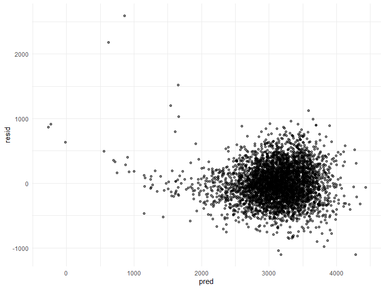
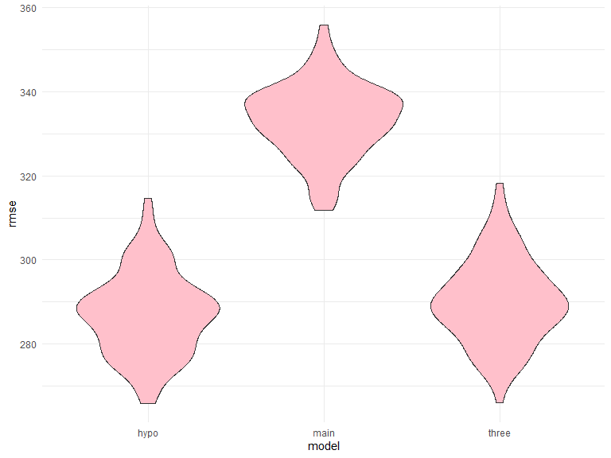

P8105_hw6_yy3295
================
Ye Yuan
2023-12-01

### Question 1

In the data cleaning code below we create a `city_state` variable,
change `victim_age` to numeric, modifiy victim_race to have categories
white and non-white, with white as the reference category, and create a
`resolution` variable indicating whether the homicide is solved. Lastly,
we filtered out the following cities: Tulsa, AL; Dallas, TX; Phoenix,
AZ; and Kansas City, MO; and we retained only the variables
`city_state`, `resolution`, `victim_age`, `victim_sex`, and
`victim_race`.

``` r
homicide_df = 
  read_csv("data/homicide-data.csv", na = c("", "NA", "Unknown")) |> 
  mutate(
    city_state = str_c(city, state, sep = ", "),
    victim_age = as.numeric(victim_age),
    resolution = case_when(
      disposition == "Closed without arrest" ~ 0,
      disposition == "Open/No arrest"        ~ 0,
      disposition == "Closed by arrest"      ~ 1)
  ) |> 
  filter(victim_race %in% c("White", "Black")) |> 
  filter(!(city_state %in% c("Tulsa, AL", "Dallas, TX", "Phoenix, AZ", "Kansas City, MO"))) |> 
  select(city_state, resolution, victim_age, victim_sex, victim_race)
```

    ## Rows: 52179 Columns: 12
    ## ── Column specification ────────────────────────────────────────────────────────
    ## Delimiter: ","
    ## chr (8): uid, victim_last, victim_first, victim_race, victim_sex, city, stat...
    ## dbl (4): reported_date, victim_age, lat, lon
    ## 
    ## ℹ Use `spec()` to retrieve the full column specification for this data.
    ## ℹ Specify the column types or set `show_col_types = FALSE` to quiet this message.

Next we fit a logistic regression model using only data from Baltimore,
MD. We model `resolved` as the outcome and `victim_age`, `victim_sex`,
and `victim_race` as predictors. We save the output as `baltimore_glm`
so that we can apply `broom::tidy` to this object and obtain the
estimate and confidence interval of the adjusted odds ratio for solving
homicides comparing non-white victims to white victims.

``` r
baltimore_glm = 
  filter(homicide_df, city_state == "Baltimore, MD") |> 
  glm(resolution ~ victim_age + victim_sex + victim_race, family = binomial(), data = _)

baltimore_glm |> 
  broom::tidy() |> 
  mutate(
    OR = exp(estimate), 
    OR_CI_upper = exp(estimate + 1.96 * std.error),
    OR_CI_lower = exp(estimate - 1.96 * std.error)) |> 
  filter(term == "victim_sexMale") |> 
  select(OR, OR_CI_lower, OR_CI_upper) |>
  knitr::kable(digits = 3)
```

|    OR | OR_CI_lower | OR_CI_upper |
|------:|------------:|------------:|
| 0.426 |       0.325 |       0.558 |

Below, by incorporating `nest()`, `map()`, and `unnest()` into the
preceding Baltimore-specific code, we fit a model for each of the
cities, and extract the adjusted odds ratio (and CI) for solving
homicides comparing non-white victims to white victims. We show the
first 5 rows of the resulting dataframe of model results.

``` r
model_results = 
  homicide_df |> 
  nest(data = -city_state) |> 
  mutate(
    models = map(data, \(df) glm(resolution ~ victim_age + victim_sex + victim_race, 
                             family = binomial(), data = df)),
    tidy_models = map(models, broom::tidy)) |> 
  select(-models, -data) |> 
  unnest(cols = tidy_models) |> 
  mutate(
    OR = exp(estimate), 
    OR_CI_upper = exp(estimate + 1.96 * std.error),
    OR_CI_lower = exp(estimate - 1.96 * std.error)) |> 
  filter(term == "victim_sexMale") |> 
  select(city_state, OR, OR_CI_lower, OR_CI_upper)

model_results |>
  slice(1:5) |> 
  knitr::kable(digits = 3)
```

| city_state      |    OR | OR_CI_lower | OR_CI_upper |
|:----------------|------:|------------:|------------:|
| Albuquerque, NM | 1.767 |       0.831 |       3.761 |
| Atlanta, GA     | 1.000 |       0.684 |       1.463 |
| Baltimore, MD   | 0.426 |       0.325 |       0.558 |
| Baton Rouge, LA | 0.381 |       0.209 |       0.695 |
| Birmingham, AL  | 0.870 |       0.574 |       1.318 |

Below we generate a plot of the estimated ORs and CIs for each city,
ordered by magnitude of the OR from smallest to largest. From this plot
we see that most cities have odds ratios that are smaller than 1,
suggesting that crimes with male victims have smaller odds of resolution
compared to crimes with female victims after adjusting for victim age
and race. This disparity is strongest in New yrok. In roughly half of
these cities, confidence intervals are narrow and do not contain 1,
suggesting a significant difference in resolution rates by sex after
adjustment for victim age and race.

``` r
model_results |> 
  mutate(city_state = fct_reorder(city_state, OR)) |> 
  ggplot(aes(x = city_state, y = OR)) + 
  geom_point() + 
  geom_errorbar(aes(ymin = OR_CI_lower, ymax = OR_CI_upper)) + 
  theme(axis.text.x = element_text(angle = 90, hjust = 1))
```


### Question 2

Download the Central Park weather data.

``` r
weather_df = 
  rnoaa::meteo_pull_monitors(
    c("USW00094728"),
    var = c("PRCP", "TMIN", "TMAX"), 
    date_min = "2022-01-01",
    date_max = "2022-12-31") |>
  mutate(
    name = recode(id, USW00094728 = "CentralPark_NY"),
    tmin = tmin / 10,
    tmax = tmax / 10) |>
  select(name, id, everything())
```

    ## using cached file: C:\Users\yale_\AppData\Local/R/cache/R/rnoaa/noaa_ghcnd/USW00094728.dly

    ## date created (size, mb): 2023-12-01 21:12:40.184534 (8.561)

    ## file min/max dates: 1869-01-01 / 2023-11-30

Use 5000 bootstrap samples.

``` r
boot_straps = 
  weather_df |>
  modelr::bootstrap(n = 5000) |>
  mutate(
    models = map(strap, \(df) lm(tmax ~ tmin + prcp, data = df)),
    results_1 = map(models, broom::tidy),
    results_2 = map(models, broom::glance)) |>
  select(-strap, -models)
```

For each bootstrap sample, produce estimates (r^2)

``` r
r2 = 
  boot_straps |>
  select(-results_1) |>
  unnest(results_2) |>
  select(.id, r.squared)
```

Plot the distribution of your estimates (r^2)

``` r
r2 |> 
  ggplot(aes(x = r.squared)) + geom_density(fill = "pink")
```


From the plot we can tell that it is a normal distribution.

Identify the 2.5% and 97.5% quantiles to provide a 95% confidence
interval (r^2)

``` r
lower_quantile_r <- quantile(r2$r.squared, 0.025)

upper_quantile_r <- quantile(r2$r.squared, 0.975)

confidence_interval_r <- c(lower_quantile_r, upper_quantile_r)

confidence_interval_r
```

    ##      2.5%     97.5% 
    ## 0.8885495 0.9406812

The 2.5% quantile is 0.889, and 97.5% quantile is 0.941.

The 95% confidence interval is (0.889, 0.941).

For each bootstrap sample, produce estimates (log(b1 \* b2))

``` r
logb = 
  boot_straps |>
  select(-results_2) |>
  unnest(results_1) |>
  select(.id, term, estimate) |>
  mutate(term = ifelse(term == "tmin", "b1",
                       ifelse(term == "prcp", "b2", term))) |>
  pivot_wider(names_from = term,
              values_from = estimate) |>
  mutate(log_new = log(b1 * b2))
```

Plot the distribution of your estimates (log(b1 \* b2))

``` r
logb |> 
  ggplot(aes(x = log_new)) + geom_density(fill = "pink")
```


From the plot we can tell that it is a left-skewed distribution.

Identify the 2.5% and 97.5% quantiles to provide a 95% confidence
interval (log(b1 \* b2))

``` r
lower_quantile_log <- quantile(logb$log_new, 0.025, na.rm = TRUE)

upper_quantile_log <- quantile(logb$log_new, 0.975, na.rm = TRUE)

confidence_interval_log <- c(lower_quantile_log, upper_quantile_log)

confidence_interval_log
```

    ##      2.5%     97.5% 
    ## -8.981559 -4.601673

The 2.5% quantile is -8.982, and 97.5% quantile is -4.602.

The 95% confidence interval is (-8.982, -4.602).

### Question 3

Load and clean the data for regression analysis

``` r
birthweight_df = 
  read_csv("data/birthweight.csv") |>
  janitor::clean_names() |>
  mutate(babysex = case_when(babysex == 1 ~ "male",
                         babysex == 2 ~ "female"),
         babysex = as.factor(babysex),
         frace = case_when(frace == 1 ~ "white",
                           frace == 2 ~ "black",
                           frace == 3 ~ "asian",
                           frace == 4 ~ "puerto_rican",
                           frace == 8 ~ "other",
                           frace == 9 ~ "unknown"),
         frace = as.factor(frace),
         malform = case_when(malform == 0 ~ "absent",
                             malform == 1 ~ "present"),
         malform = as.factor(malform),
         mrace = case_when(mrace == 1 ~ "white",
                           mrace == 2 ~ "black",
                           mrace == 3 ~ "asian",
                           mrace == 4 ~ "puerto_rican",
                           mrace == 8 ~ "other"),
         mrace = as.factor(mrace))
```

    ## Rows: 4342 Columns: 20
    ## ── Column specification ────────────────────────────────────────────────────────
    ## Delimiter: ","
    ## dbl (20): babysex, bhead, blength, bwt, delwt, fincome, frace, gaweeks, malf...
    ## 
    ## ℹ Use `spec()` to retrieve the full column specification for this data.
    ## ℹ Specify the column types or set `show_col_types = FALSE` to quiet this message.

Check if there are missing values

``` r
sum(is.na(birthweight_df))
```

    ## [1] 0

There are no missing values for the data.

Propose a regression model for birth weight.

``` r
hypo_mod = lm(bwt ~ bhead + blength + gaweeks, data = birthweight_df)
```

Show a plot of model residuals against fitted values – use
add_predictions and add_residuals.

``` r
birthweight_df |>
  add_predictions(hypo_mod) |>
  add_residuals(hypo_mod) |>
  ggplot(aes(x = pred, y = resid)) + geom_point(alpha = 0.5)
```



Compare the hypo model to the model using length at birth and
gestational age as predictors (main effects only), and the model using
head circumference, length, sex, and all interactions (including the
three-way interaction) between these.

``` r
main_effect_mod = lm(bwt ~ bhead + gaweeks, data = birthweight_df)

three_way_inter_mod = lm(bwt ~ bhead + blength + babysex + (bhead * blength) + (bhead * babysex) + (blength * babysex) + (bhead * blength * babysex), data = birthweight_df)
```

convert the resample objects produced by crossv_mc to dataframes.

``` r
cv_df = 
  crossv_mc(birthweight_df, 100) |>
 mutate(
    train = map(train, as_tibble),
    test = map(test, as_tibble))
```

Fit models to training data and obtain corresponding RMSEs for the
testing data.

``` r
cv_df = 
  cv_df |> mutate(
    hypo_mod  = map(train, \(df) lm(bwt ~ bhead + blength + gaweeks, data = df)),
    main_effect_mod = map(train, \(df) lm(bwt ~ bhead + gaweeks, data = df)),
    three_way_inter_mod = map(train, \(df) lm(bwt ~ bhead + blength + babysex + (bhead * blength) + (bhead * babysex) + (blength * babysex) + (bhead * blength * babysex), data = df)))|> 
  mutate(
    rmse_hypo = map2_dbl(hypo_mod, test, \(mod, df) rmse(model = mod, data = df)),
    rmse_main = map2_dbl(main_effect_mod, test, \(mod, df) rmse(model = mod, data = df)),
    rmse_three = map2_dbl(three_way_inter_mod, test, \(mod, df) rmse(model = mod, data = df)))
```

plot the prediction error distribution for each candidate model.

``` r
cv_df |>
  select(starts_with("rmse")) |>
  pivot_longer(everything(),
               names_to = "model",
               values_to = "rmse",
               names_prefix = "rmse_") |>
  mutate(model = fct_inorder(model)) |>
  ggplot(aes(x = model, y = rmse)) + geom_violin(fill = "pink")
```



From the plot we can tell that the hypothesized model is the most
appropriate model among all the three models as it has the lowest RMSE.
Though, the three way interaction model also has low RMSE, the
hypothesized model is still the most appropriate one.
